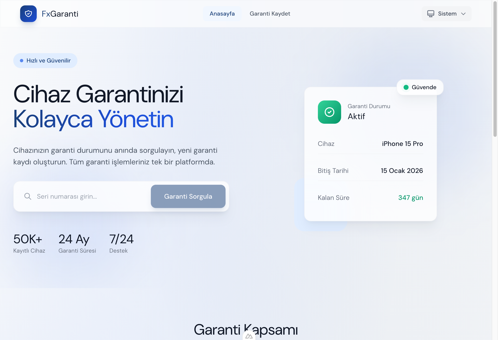
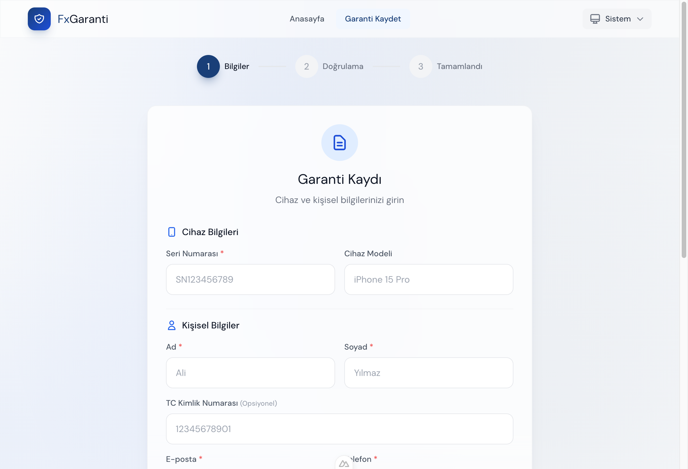
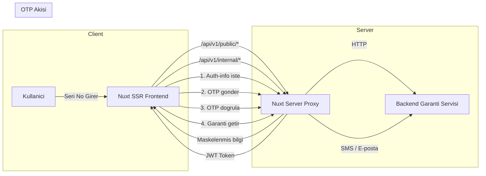

<div align="center">


# FxGaranti

**Cihaz Garanti Yonetim Sistemi**

Seri numarasi ile garanti sorgulama, OTP dogrulamali kayit ve admin yonetim paneli sunan modern SSR web uygulamasi.

[](https://nuxt.com/)
[](https://vuejs.org/)
[](https://tailwindcss.com/)
[](https://www.typescriptlang.org/)
[](https://pinia.vuejs.org/)
[](https://www.docker.com/)

[**servis.fixpro.com.tr**](https://servis.fixpro.com.tr)

</div>

---

## Ekran Goruntuleri

<table>
  <tr>
    <td align="center" width="50%">
      
      <br />
      <b>Anasayfa</b> — Garanti sorgulama ve kapsam bilgileri
    </td>
    <td align="center" width="50%">
      
      <br />
      <b>Garanti Kayit</b> — Cok adimli form ile garanti olusturma
    </td>
  </tr>
</table>

## Ozellikler

| | Ozellik | Aciklama |
|---|---------|----------|
| :mag: | **Garanti Sorgulama** | Seri numarasi ile aninda garanti durumu kontrolu |
| :shield: | **Guvenli Kayit** | OTP dogrulamali cok adimli garanti kayit formu |
| :lock: | **Admin Paneli** | Basvurulari yonetme, filtreleme ve coklu kriterde arama |
| :crescent_moon: | **Dark / Light Tema** | Sistem tercihine uyumlu otomatik tema destegi |
| :rocket: | **SSR** | Server-side rendering ile hizli yukleme ve SEO uyumluluk |
| :bar_chart: | **Analytics** | Self-hosted Umami entegrasyonu ile kullanici davranis takibi |
| :iphone: | **Responsive** | Mobil ve masaustu uyumlu tasarim |
| :framed_picture: | **Fatura Yukleme** | Gorsel ve PDF destekli fatura yukleme (maks. 5MB) |

## Mimari



## Tech Stack

<table>
  <tr>
    <td align="center"><b>Kategori</b></td>
    <td><b>Teknolojiler</b></td>
  </tr>
  <tr>
    <td align="center">Framework</td>
    <td>
      
      
      
    </td>
  </tr>
  <tr>
    <td align="center">UI</td>
    <td>
      
      
      
    </td>
  </tr>
  <tr>
    <td align="center">State & HTTP</td>
    <td>
      
      
    </td>
  </tr>
  <tr>
    <td align="center">Deploy</td>
    <td>
      
      
    </td>
  </tr>
  <tr>
    <td align="center">Analytics</td>
    <td>
      
    </td>
  </tr>
  <tr>
    <td align="center">Paket Yoneticisi</td>
    <td>
      
      
    </td>
  </tr>
</table>

## Hizli Baslatma

**1.** Repo'yu klonlayin

```bash
git clone https://github.com/user/fx-garanti-ui.git
cd fx-garanti-ui
```

**2.** Bagimliliklari yukleyin

```bash
pnpm install
```

**3.** Ortam degiskenlerini yapilandirin

Proje kokune `.env` dosyasi olusturun:

| Degisken | Zorunlu | Aciklama |
|----------|---------|----------|
| `WARRANTY_SERVICE_URL` | Evet | Backend API adresi (orn. `http://localhost:3001`) |
| `NUXT_PUBLIC_UMAMI_SCRIPT_URL` | Hayir | Umami analytics script URL |
| `NUXT_PUBLIC_UMAMI_WEBSITE_ID` | Hayir | Umami website ID |

**4.** Gelistirme sunucusunu baslatin

```bash
pnpm dev
```

Uygulama [http://localhost:3000](http://localhost:3000) adresinde calisir.

**5.** Production build

```bash
pnpm build
pnpm preview
```

<details>
<summary><b>Proje Yapisi</b></summary>

```
app/
├── components/              # Vue komponentleri
│   ├── AppHeader.vue            # Site header ve navigasyon
│   ├── ThemeToggle.vue          # Tema secici (Dark/Light/System)
│   └── OtpVerification.vue     # OTP dogrulama
├── composables/             # Vue composable'lar
│   ├── useApi.ts                # Public API istemcisi
│   ├── useAdminApi.ts           # Admin API istemcisi
│   ├── useTheme.ts              # Tema yonetimi
│   └── useTracking.ts          # Analytics event tracking
├── stores/                  # Pinia store'lar
│   ├── auth.ts                  # Kullanici oturum yonetimi
│   ├── admin.ts                 # Admin auth state
│   └── warranty.ts              # Garanti state
├── layouts/                 # Sayfa layout'lari
│   ├── default.vue              # Varsayilan layout
│   └── admin.vue                # Admin panel layout
├── pages/                   # Sayfalar (file-based routing)
│   ├── index.vue                # Anasayfa — sorgulama
│   ├── kayit.vue                # Garanti kayit formu
│   ├── garanti/
│   │   └── [serialNumber].vue   # Garanti detay
│   └── kontrol/
│       ├── giris.vue            # Admin giris
│       └── index.vue            # Admin panel
├── plugins/
│   └── umami.client.ts         # Umami script injection
└── types/index.ts           # TypeScript tanimlari

server/
├── routes/api/              # API proxy route'lari
└── middleware/               # Server middleware'leri
```

</details>

<details>
<summary><b>API Referansi</b></summary>

Uygulama, backend garanti servisine Nuxt server route'lari uzerinden proxy yapar:

### Public Endpoints

| Method | Endpoint | Aciklama |
|--------|----------|----------|
| `GET` | `/api/v1/public/warranties/:sn/auth-info` | Maskelenmis iletisim bilgileri |
| `POST` | `/api/v1/public/otp` | OTP kodu gonder |
| `POST` | `/api/v1/public/sessions` | OTP dogrula, JWT token al |
| `GET` | `/api/v1/public/warranties/:sn` | Garanti detay sorgula (token gerekli) |
| `POST` | `/api/v1/public/warranties` | Garanti kaydi olustur (multipart/form-data) |

### Internal (Admin) Endpoints

Admin endpoint'leri `/api/v1/internal/*` uzerinden backend'e yonlendirilir. JWT Bearer token ile yetkilendirme gerektirir.

| Method | Endpoint | Aciklama |
|--------|----------|----------|
| `POST` | `/api/v1/internal/auth/login` | Admin giris |
| `GET` | `/api/v1/internal/warranties` | Tum garantileri listele / filtrele / ara |
| `PATCH` | `/api/v1/internal/warranties/:id` | Garanti durumunu guncelle |

</details>

## Deploy

Multi-stage Docker build ile [CapRover](https://caprover.com/)'a deploy edilir.

```bash
# Tek komut ile deploy
pnpm deploy
```

> `git archive` ile commit'li dosyalar paketlenir ve CapRover'a gonderilir. Build production sunucuda gerceklesir.

### Docker ile Manuel Calistirma

```bash
docker build -t fx-garanti-ui .
docker run -p 3000:3000 \
  -e WARRANTY_SERVICE_URL=http://backend:3001 \
  fx-garanti-ui
```

## Lisans

Bu proje ozel kullanim icin gelistirilmistir. Tum haklari saklidir.
